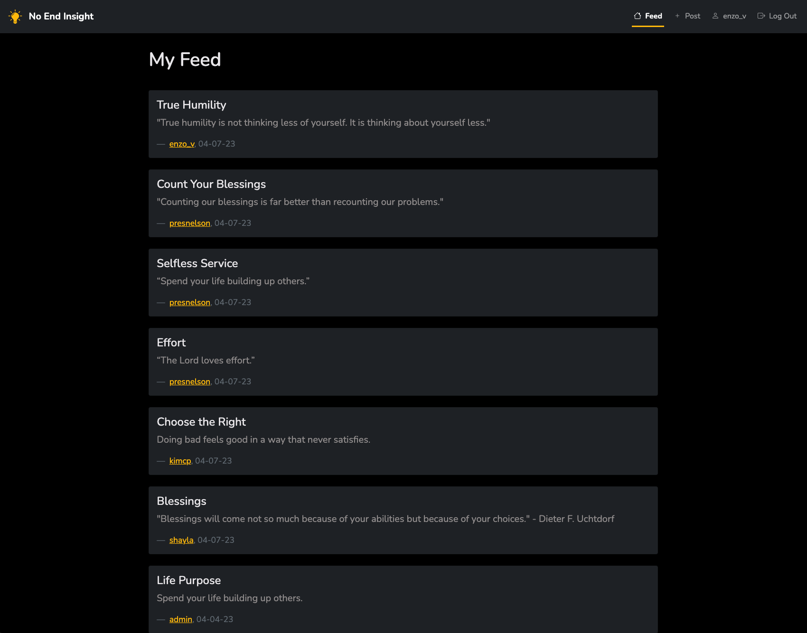
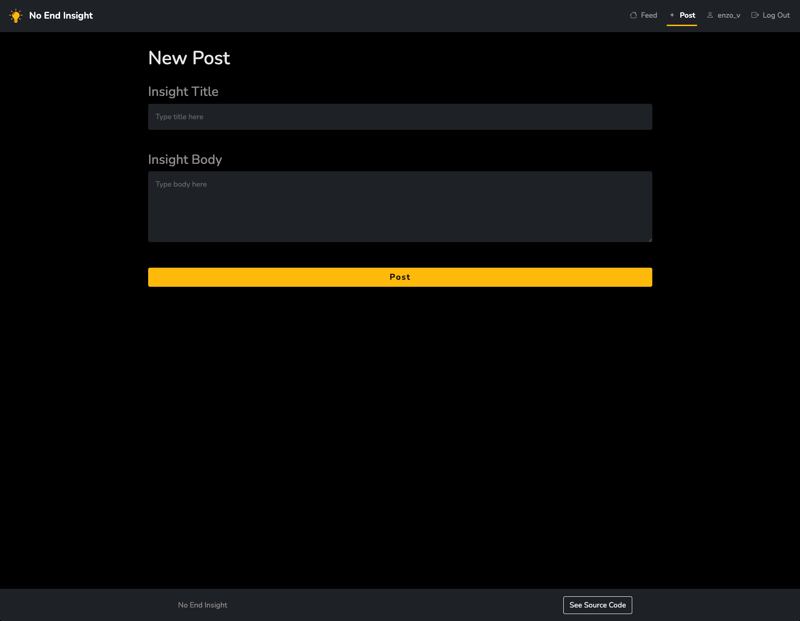
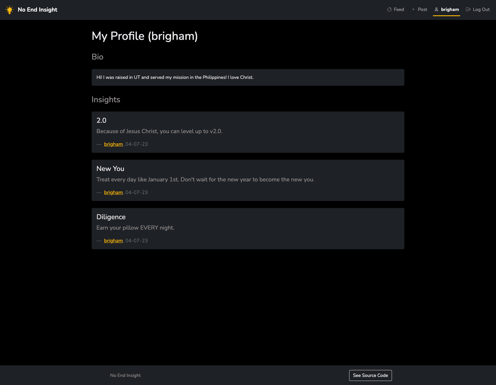
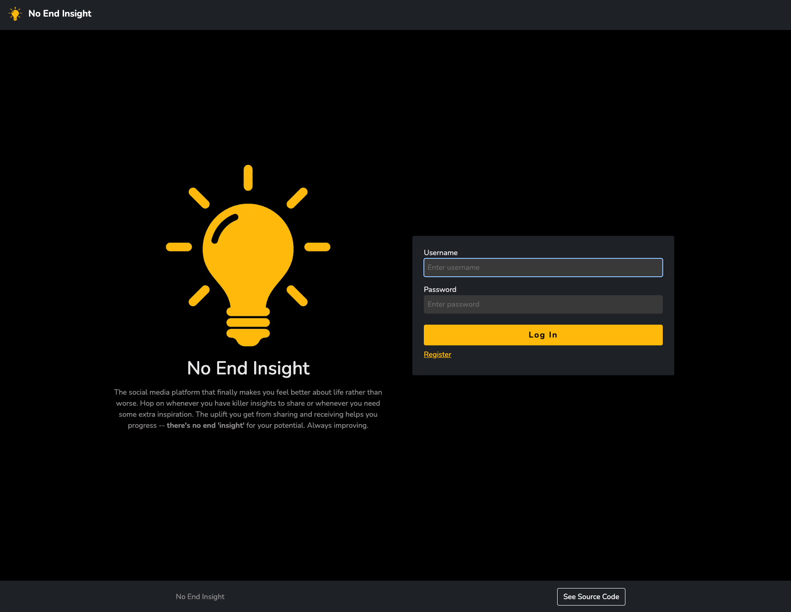
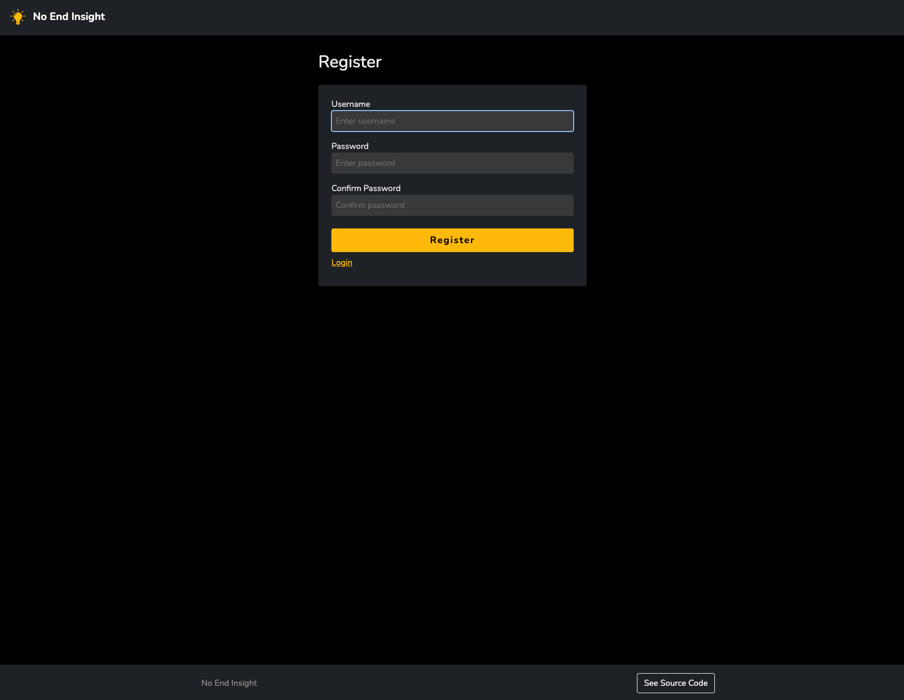
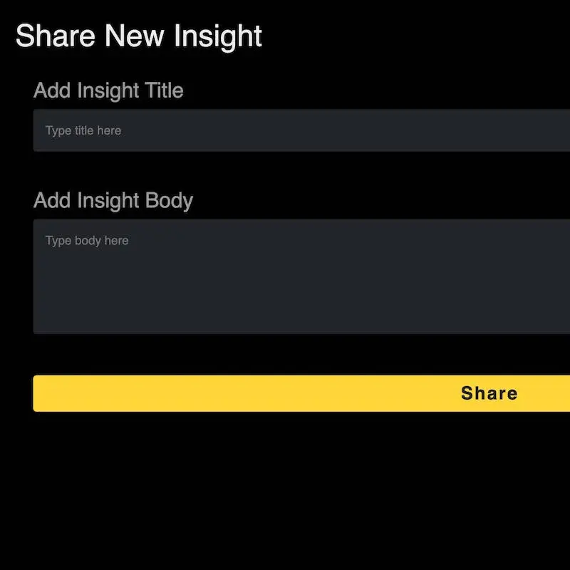

# No End Insight

An online social media platform for sharing uplifting insights! Only the front-end (HTML and Bootstrap CSS) was completed for school, and I've since hooked it up with a back-end with live data as a fun side project!














### Installation

```
python -m venv .venv
source .venv/bin/activate
pip install -r requirements.txt
touch .env
```

Make sure to fill `.env` with correct contents (see [`.env.example`](/.env.example)).

### Virtual environment commands

Create virtual environment

```
python -m venv .venv
```

Activate virtual environment

```
source .venv/bin/activate
```

Deactivate virtual environment

```
deactivate
```

Update requirements.txt with currently installed dependencies

```
pip freeze > requirements.txt
```

Install dependencies listed in requirements.txt

```
pip install -r requirements.txt
```

### Usage locally

```
python app.py
```

### Usage/deployment to production

```
pm2 start pm2.json
```

Behind the scenes this runs `python3 -m gunicorn -w 1 --bind 0.0.0.0:5003 wsgi:app`. This runs the app with gunicorn on the right port, then pm2 manages it, handling automatic restarts. `-w 1` means just use 1 worker process (doing this because I have only 1 CPU on the virtual server). If you try to run gunicorn without pm2 and want it in the background, you'll need to add the `--daemon` flag.

### TODO

- [ ] Put auth behind middleware for better reuse and separation of concerns.
